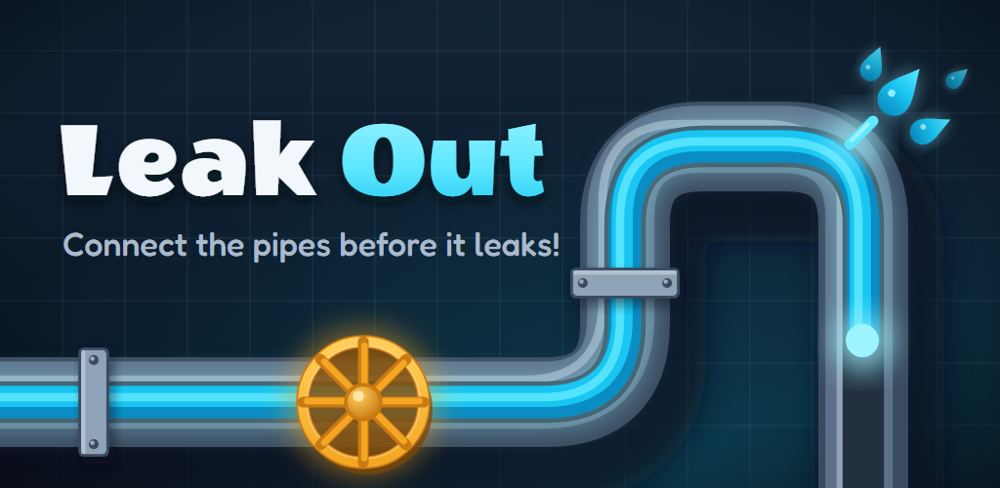
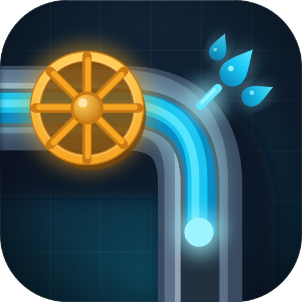
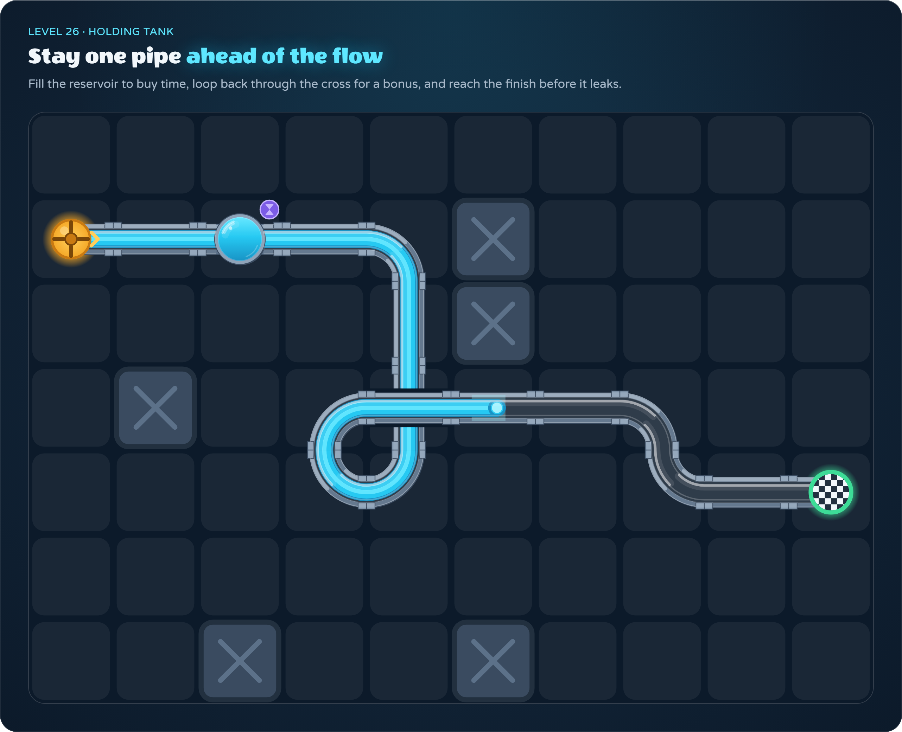
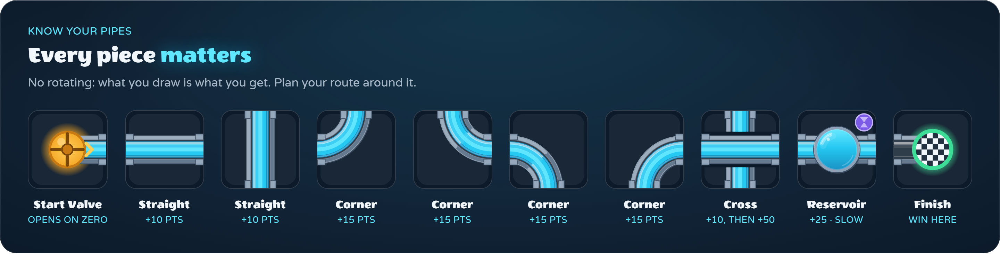
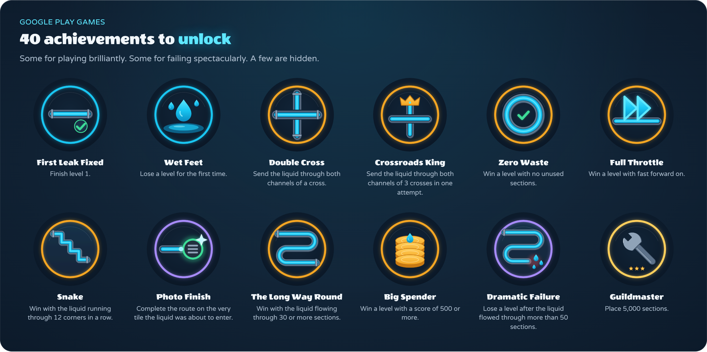

 

# Leak Out

### The clock is ticking. The valve is open. Don't let it leak.

**A fast, juicy pipe-building puzzle game for Android.**

[**Become a tester**](#-become-a-tester) · [**Report a bug**](../../issues/new?template=bug_report.yml) · [**Request a feature**](../../issues/new?template=feature_request.yml) · [**Browse issues**](../../issues)

---

## 💧 What is Leak Out?

A level starts. A brass **start valve** sits on one side of the board, a **checkered finish** on the other. Between them: an empty grid, a stack of random pipe pieces and a countdown.

When the countdown hits zero, the water starts flowing. **Every pipe you've laid had better be in the right place**, because the moment the water reaches an open end, it leaks, and the level is lost.

Simple to learn. Surprisingly hard to put down.

<table>
<tr>
<td width="33%" valign="top">

### 🧩 Plan
Drag the next piece from the stack onto the board. You only get the one at the bottom, so think ahead about where the awkward ones go.

</td>
<td width="33%" valign="top">

### ⏱️ Race
The countdown runs while you build. Once the water starts flowing, you're building just ahead of the flow, one tile at a time.

</td>
<td width="33%" valign="top">

### ⭐ Master
Route the water into the finish to win. Use every piece you placed, chain crosses and long detours for the big scores, and collect all three stars.

</td>
</tr>
</table>

  

---

## 🔧 Know your pipes

  

| Piece | What it does |
|---|---|
| **Start valve & finish** | The water leaves the brass valve when the countdown hits zero, and must enter the checkered finish through its open side. |
| **Straights & corners** | The basics. No rotating: what you draw is what you get, so plan around it. |
| **Cross** | Two independent channels in one tile. Send the water through it **twice** for a +50 bonus. |
| **Reservoir** | A tank that fills slowly and **buys you precious seconds**. It only runs left to right, so you have to earn the delay. |

Placed the wrong piece? You can swap out any pipe the water hasn't reached yet, **but replacing costs time**. Every second counts.

---

## ✨ Features

- 🌊 **96 hand-crafted levels**, from a gentle first leak to sprawling 16 × 12 boards with walls, tight timers and fast flow
- 🏆 **40 achievements** with **Google Play Games** sign-in, so your progress follows you
- ⭐ **Three-star scoring**: points for every pipe the water passes through, a penalty for every one it doesn't
- ⏩ **Fast forward**: once your route is complete, speed the water up 10× and watch it run
- 🔍 **Pan & pinch-zoom** on the big boards
- 🎵 **Ten background tracks** and punchy sound effects, each with its own volume control
- 📳 **Haptic feedback** for replacing pieces, close calls and leaks (you can turn it off)
- 💡 **Tips** to help you get unstuck
- 📵 **Plays offline.** No ads, no energy bars, no waiting to play your next level

---

## 🏅 Bragging rights

  

Some are earned by playing well. Some are earned by failing *spectacularly*. A few are hidden. Can you find them all?

---

## 🧪 Become a tester

Leak Out is in testing on Google Play, and you can play it **today**. Two steps:

1. **Join the Google Group** [**leak-out**](https://groups.google.com/g/leak-out). Membership is what gives you access to the test.
2. **Opt in to testing** at [**play.google.com/apps/testing/nl.hexmaster.leakout**](https://play.google.com/apps/testing/nl.hexmaster.leakout), using the same Google account you joined the group with. Then download the game from Google Play.

> [!NOTE]
> It can take **up to 20 minutes** after joining before the game can be downloaded. If Google Play says the app isn't available yet, grab a coffee and try again a little later. ☕

As a tester you get every new build first. Found a problem, or got an idea? [Tell us here](#-found-a-leak-in-the-game-itself).

---

## 🐛 Found a leak in the game itself?

This repository is the public home of Leak Out, the place to report problems and share ideas. The game's source code is private.

<table>
<tr>
<td width="50%" valign="top" align="center">

### 🐞 Bug report
Something broke, looks off or doesn't behave the way it should?

**[Report a bug →](../../issues/new?template=bug_report.yml)**

</td>
<td width="50%" valign="top" align="center">

### 💡 Feature request
Got an idea for a new pipe, a mechanic, a level pack or anything else?

**[Suggest a feature →](../../issues/new?template=feature_request.yml)**

</td>
</tr>
</table>

Before opening a new issue, please [search the existing ones](../../issues). If somebody already reported it, a 👍 on their issue helps us decide what to fix first.

---

**Made with 💙 and a lot of plumbing by [HexMaster](https://github.com/hexmasternl).**

Google Play and the Google Play logo are trademarks of Google LLC.

